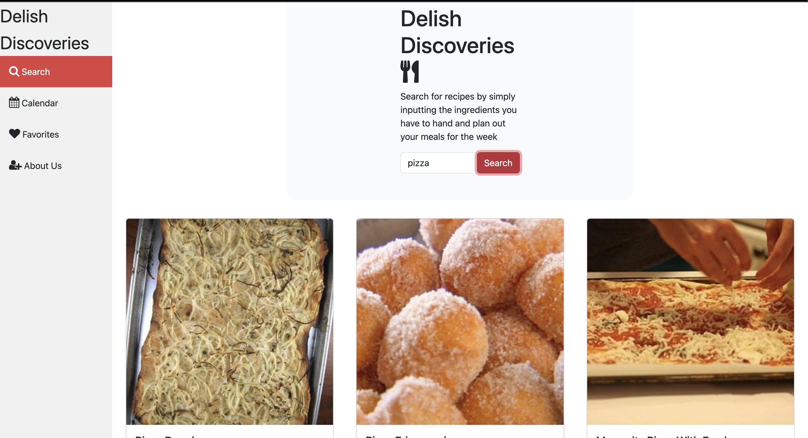

# Delish Discoveries
## Your meals, planned!

## Description
Delish Discoveries is an app designed for culinary enthusiasts and adventurous foodies. Whether you are a fan of spicy street food or elegant desserts, our app ensures every recommendation suits your taste.
This recipe finder can provide you with a wide range of options especially when you are simply not sure what to make for a meal. Therefore, our objective is to inspire users and facilitate their exploration of novel culinary creations.
It is very easy to use, users can search for recipes by simply inputting the ingredients they have on hand, reduce food waste, and plan out their meals for the week. 

## Dev Requirements
Git/GitBash, VS Code, and the source code, of course! 🛠️

## Dev Environment Setup
To get the development environment running:
1. Clone this repo
2. Open the repo folder in VS Code
3. Right-click on `index.html` and open it using the default browser.

- `index.html`: Contains all HTML code for the scheduler
- `assets/js/`: Contains all javaScript for the webapp
- `assets/css/`: Contains all CSS styling for the webapp
- `assets/images/`: Contains all images used in the webpage

## Enduser usage instructions
There is no special requirements for end users. Simply visit [here] (https://rossne99.github.io/Delish-Discoveries/) and start navigating!

## Features
- **Generate recipes based on inputted ingredient**
- **Plan your meals for the future**
- **Display and save your chosen meals in a calendar**
- **Compare chart nutritional info**
- **Add your meals to favourites** 

## How to contribute
1. Fork this repository
2. Clone the repository
3. Create a branch for your bug fix or feature
4. Make necessary changes and commit those changes
5. Push changes to GitHub
6. Create a pull request to this repo to submit your changes for review

## Technologies
- **JavaScript**
- **Bootstrap**
- **HTML**
- **CSS**
- **Jquery**
- **DayJS**
- **API Edamam**
- **Chart.js**
- **Full Calendar**

## Screenshot

The following image shows the web application's appearance and functionality:

  

> **Note**: This is the main page of the website.

## Credits 
- **Ross GitHub: RossNE99** 
- **Obaid GitHub: obaid333**
- **Leonie GitHub: LeonieWhitehead**
- **Mahamuda GitHub: m-maha21**
- **Ifeoma GitHub: ifeoma101**

## Installation
N/A

## Licence

MIT License

Copyright (c) 2023 RossNE99

Permission is hereby granted, free of charge, to any person obtaining a copy
of this software and associated documentation files (the "Software"), to deal
in the Software without restriction, including without limitation the rights
to use, copy, modify, merge, publish, distribute, sublicense, and/or sell
copies of the Software, and to permit persons to whom the Software is
furnished to do so, subject to the following conditions:

The above copyright notice and this permission notice shall be included in all
copies or substantial portions of the Software.

THE SOFTWARE IS PROVIDED "AS IS", WITHOUT WARRANTY OF ANY KIND, EXPRESS OR
IMPLIED, INCLUDING BUT NOT LIMITED TO THE WARRANTIES OF MERCHANTABILITY,
FITNESS FOR A PARTICULAR PURPOSE AND NONINFRINGEMENT. IN NO EVENT SHALL THE
AUTHORS OR COPYRIGHT HOLDERS BE LIABLE FOR ANY CLAIM, DAMAGES OR OTHER
LIABILITY, WHETHER IN AN ACTION OF CONTRACT, TORT OR OTHERWISE, ARISING FROM,
OUT OF OR IN CONNECTION WITH THE SOFTWARE OR THE USE OR OTHER DEALINGS IN THE
SOFTWARE.